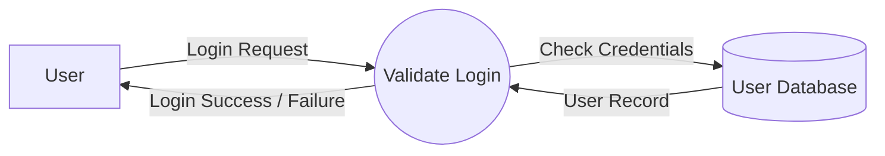
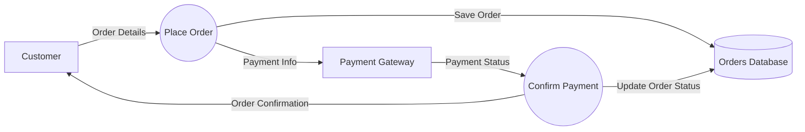
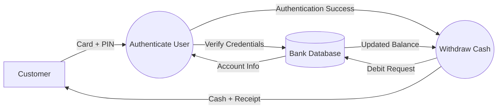
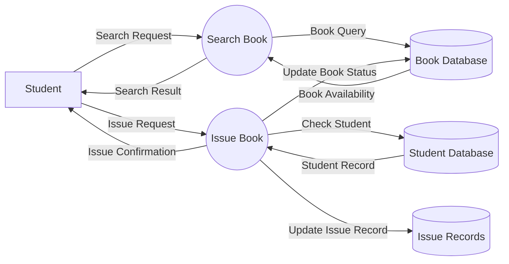
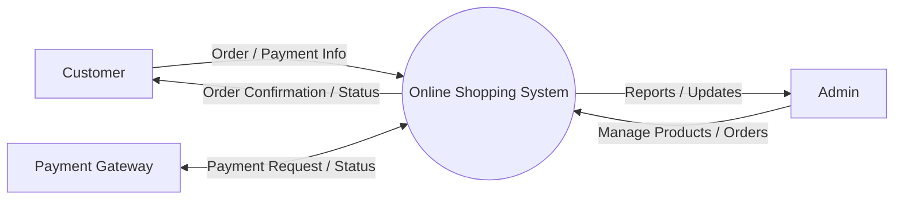
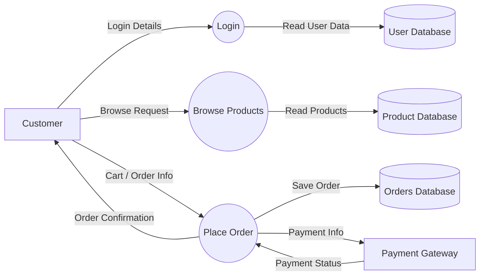
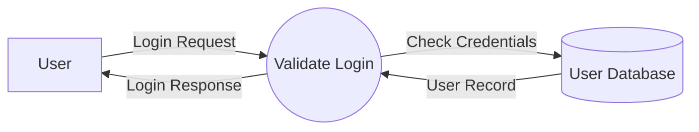
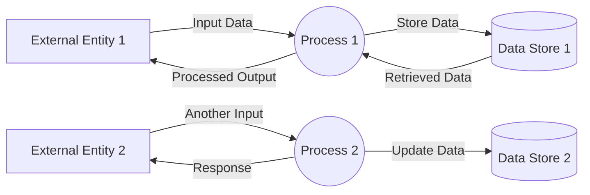

Absolutely — Mermaid **can draw DFD-like diagrams**, but one small truth first:

> **Mermaid does not have a dedicated official “DFD” syntax** like UML or BPMN.
> So we usually create a **DFD-style diagram using `flowchart`**.

That is perfectly fine for:

- interview notes
- documentation
- Jira / Confluence
- GitHub README
- system design notes

---

# 1) Simple **Login System DFD** (Mermaid)

---

## Meaning

- **User** = External Entity
- **Validate Login** = Process
- **User Database** = Data Store
- **Arrows** = Data Flow

---

# 2) **E-commerce Order System DFD** (Better Example)

---

## Explanation

### External Entities:

- Customer
- Payment Gateway

### Processes:

- Place Order
- Confirm Payment

### Data Store:

- Orders Database

### Data Flows:

- Order Details
- Payment Info
- Payment Status
- Order Confirmation

---

# 3) **ATM System DFD** (Very Interview Friendly)

---

# 4) **Library Management System DFD**

---

# 5) **Level 0 DFD (Context Diagram) — Online Shopping System**

This is very useful if you want to show **high-level view only**.

---

# 6) **Level 1 DFD — Online Shopping System**

This is more detailed.

---

# Best Mermaid Styling Tip for DFD

You can make it look more like a DFD by using:

- **Rectangle** → external entity
- **Double circle style node** → process
- **Database shape** → data store

### Good pattern:

- `[User]` → entity
- `((Validate Login))` → process
- `[(User Database)]` → data store

That gives a clean DFD feel.

---

# Recommended Interview Version (Best One to Remember)

If someone asks you in interview or exam:

## “Show me a DFD example in Mermaid”

Use this:

Because it is:

- simple
- correct
- easy to explain

---

# Bonus: DFD Template You Can Reuse

Here is a **generic Mermaid DFD template**:

---

If you want, I can next give you a **proper Mermaid DFD for one of these specifically**:

1. **ATM System**
2. **E-commerce App**
3. **User Login / Auth System**
4. **Library Management System**
5. **Food Delivery App**
6. **UPI Payment Flow**

I can make it in **interview-ready clean format**.
